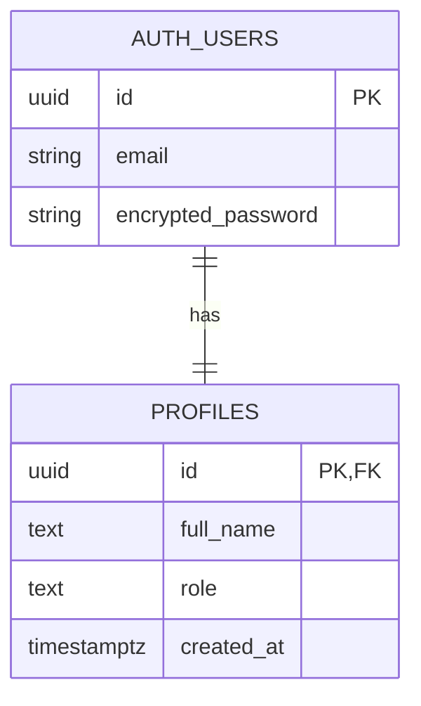
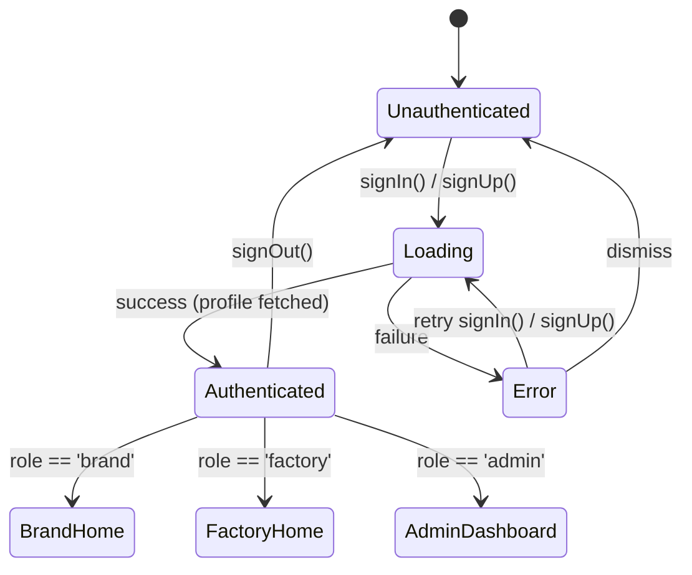

# Data Model: Supabase Authentication & Role-Based Routing

**Branch**: `002-supabase-auth-roles` | **Date**: 2026-02-26

## Entities

### UserProfile

Represents a registered user's identity and role in the platform.

| Field | Type | Description | Constraints |
|-------|------|-------------|-------------|
| `id` | `String` (UUID) | Unique user identifier | PK, references `auth.users.id` |
| `fullName` | `String` | User's display name | Non-empty, trimmed |
| `role` | `String` (enum) | Platform role | One of: `'brand'`, `'factory'`, `'admin'` |
| `createdAt` | `DateTime` | Account creation timestamp | Auto-set on insert |

**Supabase table**: `profiles`

```sql
-- Assumed pre-existing (created manually in Supabase dashboard)
CREATE TABLE profiles (
  id UUID PRIMARY KEY REFERENCES auth.users(id) ON DELETE CASCADE,
  full_name TEXT NOT NULL,
  role TEXT NOT NULL CHECK (role IN ('brand', 'factory', 'admin')),
  created_at TIMESTAMPTZ DEFAULT now()
);

-- RLS policy (recommended)
ALTER TABLE profiles ENABLE ROW LEVEL SECURITY;
CREATE POLICY "Users can read own profile" ON profiles FOR SELECT USING (auth.uid() = id);
CREATE POLICY "Users can insert own profile" ON profiles FOR INSERT WITH CHECK (auth.uid() = id);
```

### Dart Domain Entity

```dart
class UserProfile extends Equatable {
  final String id;
  final String fullName;
  final String role; // 'brand' | 'factory' | 'admin'
  final DateTime createdAt;

  const UserProfile({
    required this.id,
    required this.fullName,
    required this.role,
    required this.createdAt,
  });

  @override
  List<Object?> get props => [id, fullName, role, createdAt];
}
```

### Dart Data Model

```dart
class UserProfileModel extends UserProfile {
  const UserProfileModel({
    required super.id,
    required super.fullName,
    required super.role,
    required super.createdAt,
  });

  factory UserProfileModel.fromJson(Map<String, dynamic> json) {
    return UserProfileModel(
      id: json['id'] as String,
      fullName: json['full_name'] as String,
      role: json['role'] as String,
      createdAt: DateTime.parse(json['created_at'] as String),
    );
  }

  Map<String, dynamic> toJson() {
    return {
      'id': id,
      'full_name': fullName,
      'role': role,
      'created_at': createdAt.toIso8601String(),
    };
  }
}
```

## Relationships



## State Transitions



## Validation Rules

| Field | Rule |
|-------|------|
| Email | Must be valid email format (validated by form + Supabase) |
| Password | Minimum 6 characters (Supabase default) |
| Full Name | Non-empty, trimmed whitespace |
| Role | Must be one of `'brand'`, `'factory'`, `'admin'` |
