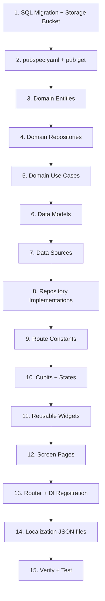

# Implementation Plan — Brand Dashboard: Search + RFQ

**Feature Branch**: `003-brand-dashboard-rfq`
**Created**: 2026-02-28
**Spec**: [spec.md](file:///d:/Flutter/b2b_marketplace/specs/003-brand-dashboard-rfq/spec.md)
**Data Model**: [data-model.md](file:///d:/Flutter/b2b_marketplace/specs/003-brand-dashboard-rfq/data-model.md)
**Research**: [research.md](file:///d:/Flutter/b2b_marketplace/specs/003-brand-dashboard-rfq/research.md)

---

## Technical Context

| Aspect             | Value                                                                    |
|--------------------|--------------------------------------------------------------------------|
| Architecture       | Clean Architecture (data / domain / presentation)                        |
| State Management   | flutter_bloc / Cubit with sealed states + Equatable                      |
| DI                 | GetIt (`injection_container.dart`)                                       |
| Navigation         | GoRouter with `AppRoutes` constants                                      |
| Error Handling     | `dartz` Either + `Failure` subclasses                                    |
| Localization       | EasyLocalization (AR / EN)                                               |
| Theme              | Material 3, light + dark mode via `AppTheme` / `AppColors`              |
| Responsive         | ScreenUtil (375×812 design size)                                         |
| Backend            | Supabase (Auth + Database + Storage)                                     |
| Existing features  | Splash, Onboarding, Role Selection, Auth (signup/login), placeholder homes |

---

## Proposed Changes

### Step 1 — Database Setup (Supabase Dashboard)

Run the SQL migration from [data-model.md](file:///d:/Flutter/b2b_marketplace/specs/003-brand-dashboard-rfq/data-model.md) in the Supabase SQL Editor to create:

- `factories` table with indexes and RLS policies (SELECT for all authenticated, INSERT/UPDATE for owner)
- `rfq_requests` table with indexes and RLS policies (INSERT/SELECT for brand, SELECT for factory owner)
- `rfq-photos` storage bucket (public, 5MB limit, image types only)

Then seed 8–10 sample factory rows for development.

---

### Step 2 — New Dependencies

#### [MODIFY] [pubspec.yaml](file:///d:/Flutter/b2b_marketplace/pubspec.yaml)

Add under `dependencies`:
```yaml
image_picker: ^1.1.2
cached_network_image: ^3.4.1
uuid: ^4.5.1
```

Run `flutter pub get`.

---

### Step 3 — Routes & Constants

#### [MODIFY] [app_routes.dart](file:///d:/Flutter/b2b_marketplace/lib/core/constants/app_routes.dart)

Add 4 new route constants:
```dart
static const String factorySearch = '/brand/factory-search';
static const String factoryProfile = '/brand/factory/:factoryId';
static const String rfqForm = '/brand/rfq-form';
static const String myRfqs = '/brand/my-rfqs';
```

---

### Step 4 — Domain Layer (Factory Feature)

#### [NEW] [factory_entity.dart](file:///d:/Flutter/b2b_marketplace/lib/features/brand/domain/entities/factory_entity.dart)

`Factory` entity class extending `Equatable` with all fields from the data model: `id`, `name`, `location`, `specialization` (List\<String\>), `moq`, `avgLeadTime`, `rating`, `ownerId`, `photos` (List\<String\>), `verified`, `createdAt`.

#### [NEW] [rfq_request.dart](file:///d:/Flutter/b2b_marketplace/lib/features/brand/domain/entities/rfq_request.dart)

`RfqRequest` entity class extending `Equatable`: `id`, `brandId`, `factoryId` (nullable), `title`, `description`, `quantity`, `photoUrls` (List\<String\>), `createdAt`.

#### [NEW] [factory_repository.dart](file:///d:/Flutter/b2b_marketplace/lib/features/brand/domain/repositories/factory_repository.dart)

Abstract repository contract:
```dart
abstract class FactoryRepository {
  Future<Either<Failure, List<Factory>>> getFactories({
    int page = 0,
    int pageSize = 20,
    String? location,
    int? maxMoq,
    double? minRating,
    String? specialization,
    String? searchQuery,
  });
  Future<Either<Failure, Factory>> getFactoryById(String id);
  Future<Either<Failure, List<Factory>>> getTopFactories({int limit = 10});
}
```

#### [NEW] [rfq_repository.dart](file:///d:/Flutter/b2b_marketplace/lib/features/brand/domain/repositories/rfq_repository.dart)

Abstract repository contract:
```dart
abstract class RfqRepository {
  Future<Either<Failure, RfqRequest>> submitRfq({
    required String title,
    required String description,
    required int quantity,
    String? factoryId,
    List<String> photoUrls = const [],
  });
  Future<Either<Failure, List<RfqRequest>>> getMyRfqs();
  Future<Either<Failure, List<String>>> uploadPhotos(List<XFile> images);
}
```

---

### Step 5 — Domain Layer (Use Cases)

All 5 use cases follow the existing `SignUpUseCase` pattern (constructor injection, `call()` method).

#### [NEW] [get_factories_usecase.dart](file:///d:/Flutter/b2b_marketplace/lib/features/brand/domain/usecases/get_factories_usecase.dart)
Passes filter params to `FactoryRepository.getFactories()`.

#### [NEW] [get_factory_by_id_usecase.dart](file:///d:/Flutter/b2b_marketplace/lib/features/brand/domain/usecases/get_factory_by_id_usecase.dart)
Calls `FactoryRepository.getFactoryById(id)`.

#### [NEW] [get_top_factories_usecase.dart](file:///d:/Flutter/b2b_marketplace/lib/features/brand/domain/usecases/get_top_factories_usecase.dart)
Calls `FactoryRepository.getTopFactories()`.

#### [NEW] [submit_rfq_usecase.dart](file:///d:/Flutter/b2b_marketplace/lib/features/brand/domain/usecases/submit_rfq_usecase.dart)
Calls `RfqRepository.submitRfq(...)`.

#### [NEW] [get_my_rfqs_usecase.dart](file:///d:/Flutter/b2b_marketplace/lib/features/brand/domain/usecases/get_my_rfqs_usecase.dart)
Calls `RfqRepository.getMyRfqs()`.

---

### Step 6 — Data Layer (Models)

#### [NEW] [factory_model.dart](file:///d:/Flutter/b2b_marketplace/lib/features/brand/data/models/factory_model.dart)

`FactoryModel extends Factory` with:
- `fromJson(Map<String, dynamic>)` — maps Supabase column names (snake_case) to entity fields
- `toJson()` — reverse mapping

#### [NEW] [rfq_request_model.dart](file:///d:/Flutter/b2b_marketplace/lib/features/brand/data/models/rfq_request_model.dart)

`RfqRequestModel extends RfqRequest` with `fromJson()` / `toJson()`.

---

### Step 7 — Data Layer (Data Sources)

#### [NEW] [factory_remote_datasource.dart](file:///d:/Flutter/b2b_marketplace/lib/features/brand/data/datasources/factory_remote_datasource.dart)

Abstract + Implementation class using `SupabaseClient`:
- `getFactories(...)` — query `factories` table with filter chain (`.ilike()`, `.lte()`, `.gte()`, `.contains()`) and `.range()` for pagination, ordered by rating DESC.
- `getFactoryById(id)` — `.eq('id', id).single()`.
- `getTopFactories(limit)` — `.order('rating', ascending: false).limit(limit)`.

#### [NEW] [rfq_remote_datasource.dart](file:///d:/Flutter/b2b_marketplace/lib/features/brand/data/datasources/rfq_remote_datasource.dart)

Abstract + Implementation class using `SupabaseClient`:
- `submitRfq(...)` — inserts into `rfq_requests` with `auth.uid()` as `brand_id`.
- `getMyRfqs()` — selects from `rfq_requests` where `brand_id = auth.uid()`, ordered by `created_at DESC`.
- `uploadPhotos(List<XFile>)` — uploads each file to `rfq-photos` bucket, returns list of public URLs.

---

### Step 8 — Data Layer (Repository Implementations)

#### [NEW] [factory_repository_impl.dart](file:///d:/Flutter/b2b_marketplace/lib/features/brand/data/repositories/factory_repository_impl.dart)

Implements `FactoryRepository`. Wraps all data source calls in try/catch, returns `Either<Failure, T>` following the `AuthRepositoryImpl` pattern.

#### [NEW] [rfq_repository_impl.dart](file:///d:/Flutter/b2b_marketplace/lib/features/brand/data/repositories/rfq_repository_impl.dart)

Implements `RfqRepository`. Same try/catch → Either pattern.

---

### Step 9 — Presentation Layer (Cubits)

#### [NEW] [factory_search_cubit.dart](file:///d:/Flutter/b2b_marketplace/lib/features/brand/presentation/bloc/factory_search_cubit.dart)
#### [NEW] [factory_search_state.dart](file:///d:/Flutter/b2b_marketplace/lib/features/brand/presentation/bloc/factory_search_state.dart)

States (sealed class `FactorySearchState`):
- `FactorySearchInitial`
- `FactorySearchLoading`
- `FactorySearchLoaded(List<Factory> factories, bool hasMore, FactoryFilters filters)`
- `FactorySearchError(String message)`

Cubit methods:
- `searchFactories({filters})` — resets list, loads first page
- `loadMore()` — loads next page, appends to existing list
- `updateFilters(FactoryFilters)` — applies new filters, re-fetches
- `loadTopFactories()` — fetches top-rated for home carousel

#### [NEW] [rfq_cubit.dart](file:///d:/Flutter/b2b_marketplace/lib/features/brand/presentation/bloc/rfq_cubit.dart)
#### [NEW] [rfq_state.dart](file:///d:/Flutter/b2b_marketplace/lib/features/brand/presentation/bloc/rfq_state.dart)

States (sealed class `RfqState`):
- `RfqInitial`
- `RfqLoading`
- `RfqSubmitted(RfqRequest rfq)`
- `RfqListLoaded(List<RfqRequest> rfqs)`
- `RfqError(String message)`

Cubit methods:
- `submitRfq({title, description, quantity, factoryId?, photos})` — uploads photos first, then submits
- `loadMyRfqs()` — fetches brand's RFQ list

---

### Step 10 — Presentation Layer (Screens)

All screens use `BlocProvider` / `BlocBuilder` / `BlocListener`, ScreenUtil for responsive sizing, `EasyLocalization` for AR/EN text, and the existing `AppColors` / `AppTextStyles` design system.

#### [MODIFY] [brand_home_page.dart](file:///d:/Flutter/b2b_marketplace/lib/features/brand/presentation/pages/brand_home_page.dart)

Replace the placeholder with the full Brand Home screen:
- **Search bar** at top → navigates to FactorySearch with query
- **Category chips** row (horizontal scroll): T-shirts, Jackets, Dresses, Denim, Activewear, Accessories → navigates to FactorySearch with specialization filter
- **Top Factories carousel** (horizontal `ListView.builder`) → each card navigates to FactoryProfile
- Bottom nav or drawer for My RFQs link
- Keeps the existing sign-out action in AppBar

#### [NEW] [factory_search_page.dart](file:///d:/Flutter/b2b_marketplace/lib/features/brand/presentation/pages/factory_search_page.dart)

- **Search/filter bar** at top with expandable filter panel (location dropdown, MOQ slider, rating slider)
- **Factory cards** in a `ListView.builder` with infinite scroll pagination
- Each card: factory name, star rating row, MOQ badge, lead time badge
- Tap card → navigates to FactoryProfile
- Empty state widget when no results

#### [NEW] [factory_profile_page.dart](file:///d:/Flutter/b2b_marketplace/lib/features/brand/presentation/pages/factory_profile_page.dart)

- **Photo gallery** (PageView with dot indicators) at top
- **Factory details section**: name + verified badge, location, specialization chips, MOQ, lead time, rating
- **"Request Quote" button** (ElevatedButton, full width) → navigates to RfqForm with factoryId

#### [NEW] [rfq_form_page.dart](file:///d:/Flutter/b2b_marketplace/lib/features/brand/presentation/pages/rfq_form_page.dart)

- Form fields: title (TextFormField), description (multiline TextFormField), quantity (number TextFormField)
- Photo picker area: grid of selected images + "Add Photo" button (uses `image_picker`)
- Submit button (disabled after first tap to prevent duplicates)
- Validation: title, description required; quantity > 0
- On success → show SnackBar + navigate to MyRfqs

#### [NEW] [my_rfqs_page.dart](file:///d:/Flutter/b2b_marketplace/lib/features/brand/presentation/pages/my_rfqs_page.dart)

- `ListView.builder` of RFQ cards (title, quantity, created date)
- Empty state widget when no RFQs
- Pull-to-refresh

---

### Step 11 — Presentation Layer (Widgets)

#### [NEW] [factory_card.dart](file:///d:/Flutter/b2b_marketplace/lib/features/brand/presentation/widgets/factory_card.dart)

Reusable card widget used in both search results and home carousel. Shows name, rating stars, MOQ, lead time. Accepts `onTap` callback.

#### [NEW] [category_chip.dart](file:///d:/Flutter/b2b_marketplace/lib/features/brand/presentation/widgets/category_chip.dart)

Styled chip widget for category filtering on home screen.

#### [NEW] [photo_gallery.dart](file:///d:/Flutter/b2b_marketplace/lib/features/brand/presentation/widgets/photo_gallery.dart)

PageView-based gallery with `CachedNetworkImage` and dot indicators.

#### [NEW] [rfq_card.dart](file:///d:/Flutter/b2b_marketplace/lib/features/brand/presentation/widgets/rfq_card.dart)

Card widget for the My RFQs list. Shows title, quantity, date.

#### [NEW] [empty_state_widget.dart](file:///d:/Flutter/b2b_marketplace/lib/core/widgets/empty_state_widget.dart)

Generic reusable empty state with icon, title, and subtitle.

---

### Step 12 — Navigation (Router)

#### [MODIFY] [app_router.dart](file:///d:/Flutter/b2b_marketplace/lib/core/router/app_router.dart)

Add 4 new routes under the existing role-based section:
```dart
GoRoute(
  path: AppRoutes.factorySearch,
  name: 'factorySearch',
  builder: (context, state) => const FactorySearchPage(),
),
GoRoute(
  path: AppRoutes.factoryProfile,
  name: 'factoryProfile',
  builder: (context, state) {
    final factoryId = state.pathParameters['factoryId']!;
    return FactoryProfilePage(factoryId: factoryId);
  },
),
GoRoute(
  path: AppRoutes.rfqForm,
  name: 'rfqForm',
  builder: (context, state) {
    final factoryId = state.extra as String?;
    return RfqFormPage(factoryId: factoryId);
  },
),
GoRoute(
  path: AppRoutes.myRfqs,
  name: 'myRfqs',
  builder: (context, state) => const MyRfqsPage(),
),
```

---

### Step 13 — Dependency Injection

#### [MODIFY] [injection_container.dart](file:///d:/Flutter/b2b_marketplace/lib/injection_container.dart)

Register all new dependencies following the existing pattern:

```dart
// ── Data sources (brand) ──
sl.registerLazySingleton<FactoryRemoteDataSource>(
  () => FactoryRemoteDataSourceImpl(sl<SupabaseClient>()),
);
sl.registerLazySingleton<RfqRemoteDataSource>(
  () => RfqRemoteDataSourceImpl(sl<SupabaseClient>()),
);

// ── Repositories (brand) ──
sl.registerLazySingleton<FactoryRepository>(
  () => FactoryRepositoryImpl(sl<FactoryRemoteDataSource>()),
);
sl.registerLazySingleton<RfqRepository>(
  () => RfqRepositoryImpl(sl<RfqRemoteDataSource>()),
);

// ── Use cases (brand) ──
sl.registerLazySingleton(() => GetFactoriesUseCase(sl<FactoryRepository>()));
sl.registerLazySingleton(() => GetFactoryByIdUseCase(sl<FactoryRepository>()));
sl.registerLazySingleton(() => GetTopFactoriesUseCase(sl<FactoryRepository>()));
sl.registerLazySingleton(() => SubmitRfqUseCase(sl<RfqRepository>()));
sl.registerLazySingleton(() => GetMyRfqsUseCase(sl<RfqRepository>()));

// ── Cubits (brand) ──
sl.registerFactory(() => FactorySearchCubit(
  getFactoriesUseCase: sl<GetFactoriesUseCase>(),
  getTopFactoriesUseCase: sl<GetTopFactoriesUseCase>(),
));
sl.registerFactory(() => RfqCubit(
  submitRfqUseCase: sl<SubmitRfqUseCase>(),
  getMyRfqsUseCase: sl<GetMyRfqsUseCase>(),
));
```

---

### Step 14 — Localization

#### [MODIFY] [en.json](file:///d:/Flutter/b2b_marketplace/assets/translations/en.json)

Add translation keys under a `brand` namespace:
```json
"brand_home": {
  "search_hint": "Search factories...",
  "top_factories": "Top Factories",
  "categories": "Categories"
},
"factory_search": {
  "title": "Find Factories",
  "filter_location": "Location",
  "filter_moq": "Max MOQ",
  "filter_rating": "Min Rating",
  "no_results": "No factories match your filters"
},
"factory_profile": {
  "request_quote": "Request Quote",
  "verified": "Verified",
  "moq_label": "Min Order",
  "lead_time_label": "Lead Time",
  "no_photos": "No photos available"
},
"rfq_form": {
  "title": "Request for Quote",
  "field_title": "Title",
  "field_description": "Description",
  "field_quantity": "Quantity",
  "add_photos": "Add Photos",
  "submit": "Submit RFQ",
  "success": "RFQ submitted successfully!",
  "error_title_required": "Title is required",
  "error_desc_required": "Description is required",
  "error_qty_required": "Quantity must be greater than 0"
},
"my_rfqs": {
  "title": "My RFQs",
  "empty": "You haven't submitted any RFQs yet",
  "quantity_label": "Qty"
}
```

#### [MODIFY] [ar.json](file:///d:/Flutter/b2b_marketplace/assets/translations/ar.json)

Arabic translations for all the above keys.

---

## File Summary

| # | Type   | File | Description |
|---|--------|------|-------------|
| 1 | MODIFY | `pubspec.yaml` | Add image_picker, cached_network_image, uuid |
| 2 | MODIFY | `app_routes.dart` | Add 4 new route constants |
| 3 | NEW | `factory_entity.dart` | Factory domain entity |
| 4 | NEW | `rfq_request.dart` | RfqRequest domain entity |
| 5 | NEW | `factory_repository.dart` | Abstract factory repository |
| 6 | NEW | `rfq_repository.dart` | Abstract RFQ repository |
| 7 | NEW | `get_factories_usecase.dart` | Search/filter factories |
| 8 | NEW | `get_factory_by_id_usecase.dart` | Fetch single factory |
| 9 | NEW | `get_top_factories_usecase.dart` | Top-rated factories |
| 10 | NEW | `submit_rfq_usecase.dart` | Submit RFQ |
| 11 | NEW | `get_my_rfqs_usecase.dart` | List brand's RFQs |
| 12 | NEW | `factory_model.dart` | FactoryModel with JSON mapping |
| 13 | NEW | `rfq_request_model.dart` | RfqRequestModel with JSON mapping |
| 14 | NEW | `factory_remote_datasource.dart` | Supabase queries for factories |
| 15 | NEW | `rfq_remote_datasource.dart` | Supabase queries + photo upload |
| 16 | NEW | `factory_repository_impl.dart` | Factory repo implementation |
| 17 | NEW | `rfq_repository_impl.dart` | RFQ repo implementation |
| 18 | NEW | `factory_search_cubit.dart` | Factory search state management |
| 19 | NEW | `factory_search_state.dart` | Factory search sealed states |
| 20 | NEW | `rfq_cubit.dart` | RFQ state management |
| 21 | NEW | `rfq_state.dart` | RFQ sealed states |
| 22 | MODIFY | `brand_home_page.dart` | Replace placeholder with full home |
| 23 | NEW | `factory_search_page.dart` | Factory search listing |
| 24 | NEW | `factory_profile_page.dart` | Factory detail screen |
| 25 | NEW | `rfq_form_page.dart` | RFQ submission form |
| 26 | NEW | `my_rfqs_page.dart` | RFQ history list |
| 27 | NEW | `factory_card.dart` | Reusable factory card widget |
| 28 | NEW | `category_chip.dart` | Category chip widget |
| 29 | NEW | `photo_gallery.dart` | Photo gallery widget |
| 30 | NEW | `rfq_card.dart` | RFQ list card widget |
| 31 | NEW | `empty_state_widget.dart` | Reusable empty state widget |
| 32 | MODIFY | `app_router.dart` | Add 4 new GoRoute entries |
| 33 | MODIFY | `injection_container.dart` | Register all new DI bindings |
| 34 | MODIFY | `en.json` | English translations |
| 35 | MODIFY | `ar.json` | Arabic translations |

**Total**: 27 new files, 8 modified files

---

## Implementation Order

The steps should be executed in this exact order to avoid import errors:



---

## Verification Plan

### Automated Checks

1. **Static analysis** — Run `dart analyze` to verify no compile errors across all new and modified files:
   ```bash
   dart analyze lib/
   ```

2. **Build verification** — Ensure the app builds without errors:
   ```bash
   flutter build apk --debug
   ```

### Manual Testing (User or Emulator)

> [!IMPORTANT]
> Manual testing requires: (1) Supabase tables created, (2) seed factory data inserted, (3) a brand user account logged in.

1. **Brand Home Screen**
   - Open app as a brand user → verify search bar, category chips, and top factories carousel are visible
   - Tap a category chip → verify navigation to Factory Search with the category pre-filtered
   - Tap a factory in the carousel → verify navigation to Factory Profile

2. **Factory Search**
   - Verify factory cards render (name, rating, MOQ, lead time)
   - Apply location filter → verify list updates
   - Apply rating filter → verify only matching factories show
   - Scroll to bottom → verify next page loads
   - Clear all filters with no matches → verify empty state shown

3. **Factory Profile**
   - Tap a factory card → verify all details display
   - Swipe photo gallery → verify images render
   - Tap "Request Quote" → verify navigation to RFQ Form

4. **RFQ Form**
   - Submit with empty fields → verify validation errors appear
   - Fill all fields, add 1-2 photos → submit → verify success message
   - Check My RFQs → verify the new RFQ appears

5. **My RFQs**
   - Navigate to My RFQs → verify list shows submitted RFQs
   - If no RFQs → verify empty state displayed
