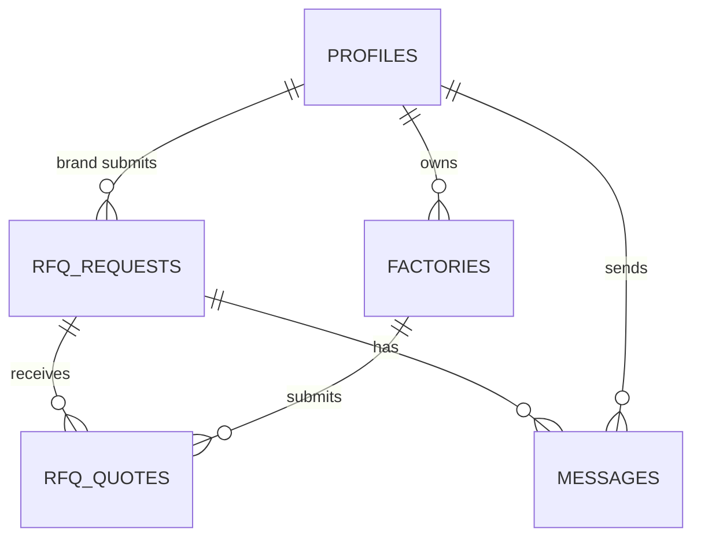
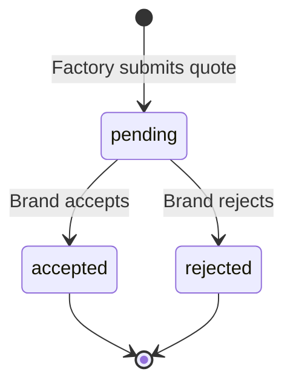

# Data Model — Factory Dashboard & Chat

**Branch**: `004-factory-dashboard-chat` | **Date**: 2026-02-28

---

## New Tables

### `rfq_quotes`

| Column | Type | Constraints |
|--------|------|-------------|
| `id` | `uuid` | PK, default `gen_random_uuid()` |
| `rfq_id` | `uuid` | FK → `rfq_requests.id`, NOT NULL |
| `factory_id` | `uuid` | FK → `profiles.id`, NOT NULL |
| `price` | `numeric` | NOT NULL, CHECK > 0 |
| `lead_time` | `integer` | NOT NULL, CHECK > 0 (days) |
| `notes` | `text` | nullable |
| `status` | `text` | NOT NULL, default `'pending'`, CHECK IN ('pending', 'accepted', 'rejected') |
| `created_at` | `timestamptz` | NOT NULL, default `now()` |

**Unique**: `(rfq_id, factory_id)` — one quote per factory per RFQ.

**RLS Policies**:
- Factory can INSERT a quote where `factory_id = auth.uid()`
- Factory can SELECT quotes where `factory_id = auth.uid()`
- Brand can SELECT quotes where `rfq_id` belongs to them (join on `rfq_requests.brand_id = auth.uid()`)
- Brand can UPDATE quote status for their own RFQs

### `messages`

| Column | Type | Constraints |
|--------|------|-------------|
| `id` | `uuid` | PK, default `gen_random_uuid()` |
| `rfq_id` | `uuid` | FK → `rfq_requests.id`, NOT NULL |
| `sender_id` | `uuid` | FK → `profiles.id`, NOT NULL |
| `message_text` | `text` | NOT NULL (min length 1 after trim) |
| `image_url` | `text` | nullable |
| `created_at` | `timestamptz` | NOT NULL, default `now()` |

**Indexes**: `(rfq_id, created_at)` for chronological message loading.

**Realtime**: Enable Supabase Realtime on this table for INSERT events.

**RLS Policies**:
- Users can INSERT messages where `sender_id = auth.uid()` AND they are a participant of the RFQ (either the brand or factory)
- Users can SELECT messages where they are a participant of the RFQ

---

## Modified Tables

### `factories` (existing)

No schema changes. The `photos` column (text array) will be populated via the new profile management screen.

---

## Storage Buckets

### `factory-photos` (new)

- **Access**: Public read, authenticated write
- **Max file size**: 5 MB
- **Allowed MIME types**: `image/jpeg`, `image/png`, `image/webp`
- **Path pattern**: `{factory_id}/{uuid}.{ext}`

### `chat-images` (new)

- **Access**: Authenticated read/write
- **Max file size**: 5 MB
- **Allowed MIME types**: `image/jpeg`, `image/png`, `image/webp`
- **Path pattern**: `{rfq_id}/{uuid}.{ext}`

---

## Entity Relationships



---

## SQL Migration

```sql
-- ============================================================
-- rfq_quotes table
-- ============================================================
CREATE TABLE IF NOT EXISTS public.rfq_quotes (
  id UUID PRIMARY KEY DEFAULT gen_random_uuid(),
  rfq_id UUID NOT NULL REFERENCES public.rfq_requests(id) ON DELETE CASCADE,
  factory_id UUID NOT NULL REFERENCES public.profiles(id) ON DELETE CASCADE,
  price NUMERIC NOT NULL CHECK (price > 0),
  lead_time INTEGER NOT NULL CHECK (lead_time > 0),
  notes TEXT,
  status TEXT NOT NULL DEFAULT 'pending' CHECK (status IN ('pending', 'accepted', 'rejected')),
  created_at TIMESTAMPTZ NOT NULL DEFAULT now(),
  UNIQUE (rfq_id, factory_id)
);

CREATE INDEX idx_rfq_quotes_rfq_id ON public.rfq_quotes(rfq_id);
CREATE INDEX idx_rfq_quotes_factory_id ON public.rfq_quotes(factory_id);

ALTER TABLE public.rfq_quotes ENABLE ROW LEVEL SECURITY;

-- Factory can insert their own quotes
CREATE POLICY "Factories can insert own quotes"
  ON public.rfq_quotes FOR INSERT
  WITH CHECK (factory_id = auth.uid());

-- Factory can view own quotes
CREATE POLICY "Factories can view own quotes"
  ON public.rfq_quotes FOR SELECT
  USING (factory_id = auth.uid());

-- Brand can view quotes on their RFQs
CREATE POLICY "Brands can view quotes on own RFQs"
  ON public.rfq_quotes FOR SELECT
  USING (
    rfq_id IN (
      SELECT id FROM public.rfq_requests WHERE brand_id = auth.uid()
    )
  );

-- Brand can update quote status on their own RFQs
CREATE POLICY "Brands can update quote status"
  ON public.rfq_quotes FOR UPDATE
  USING (
    rfq_id IN (
      SELECT id FROM public.rfq_requests WHERE brand_id = auth.uid()
    )
  )
  WITH CHECK (
    rfq_id IN (
      SELECT id FROM public.rfq_requests WHERE brand_id = auth.uid()
    )
  );

-- ============================================================
-- messages table
-- ============================================================
CREATE TABLE IF NOT EXISTS public.messages (
  id UUID PRIMARY KEY DEFAULT gen_random_uuid(),
  rfq_id UUID NOT NULL REFERENCES public.rfq_requests(id) ON DELETE CASCADE,
  sender_id UUID NOT NULL REFERENCES public.profiles(id) ON DELETE CASCADE,
  message_text TEXT NOT NULL CHECK (length(trim(message_text)) > 0),
  image_url TEXT,
  created_at TIMESTAMPTZ NOT NULL DEFAULT now()
);

CREATE INDEX idx_messages_rfq_created ON public.messages(rfq_id, created_at);

ALTER TABLE public.messages ENABLE ROW LEVEL SECURITY;

-- Participants can insert messages (sender must be auth.uid())
CREATE POLICY "Users can send messages as themselves"
  ON public.messages FOR INSERT
  WITH CHECK (
    sender_id = auth.uid()
    AND (
      rfq_id IN (SELECT id FROM public.rfq_requests WHERE brand_id = auth.uid())
      OR rfq_id IN (SELECT id FROM public.rfq_requests WHERE factory_id = auth.uid())
    )
  );

-- Participants can view messages on their RFQs
CREATE POLICY "Participants can view messages"
  ON public.messages FOR SELECT
  USING (
    rfq_id IN (SELECT id FROM public.rfq_requests WHERE brand_id = auth.uid())
    OR rfq_id IN (SELECT id FROM public.rfq_requests WHERE factory_id = auth.uid())
  );

-- ============================================================
-- Enable Realtime on messages table
-- ============================================================
ALTER PUBLICATION supabase_realtime ADD TABLE public.messages;

-- ============================================================
-- Storage buckets (run via Supabase Dashboard or management API)
-- ============================================================
-- factory-photos: public bucket, 5MB limit, image/* only
-- chat-images: private bucket, 5MB limit, image/* only
```

---

## State Transitions

### Quote Status


