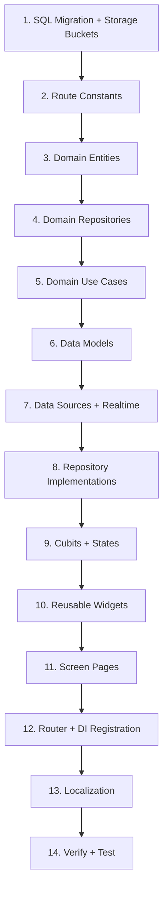

# Implementation Plan — Factory Dashboard & Chat

**Branch**: `004-factory-dashboard-chat` | **Date**: 2026-02-28 | **Spec**: [spec.md](file:///d:/Flutter/b2b_marketplace/specs/004-factory-dashboard-chat/spec.md)
**Data Model**: [data-model.md](file:///d:/Flutter/b2b_marketplace/specs/004-factory-dashboard-chat/data-model.md)
**Research**: [research.md](file:///d:/Flutter/b2b_marketplace/specs/004-factory-dashboard-chat/research.md)

---

## Summary

Implement the Factory Dashboard feature (Phase 4) including: factory dashboard home with statistics, RFQ inbox with quote submission, factory profile management with photo gallery, real-time chat per RFQ, and active orders tracking. All following the existing clean architecture with flutter_bloc, GetIt DI, GoRouter, and Supabase backend.

## Technical Context

| Aspect | Value |
|--------|-------|
| Architecture | Clean Architecture (data / domain / presentation) |
| State Management | flutter_bloc / Cubit with sealed states |
| DI | GetIt (`injection_container.dart`) |
| Navigation | GoRouter with route name strings |
| Error Handling | `dartz` Either + `Failure` subclasses |
| Localization | EasyLocalization (AR / EN) |
| Theme | Material 3, light + dark mode |
| Backend | Supabase (Auth + DB + Storage + Realtime) |
| Existing features | Auth, Brand Dashboard, Factory Search, RFQ submission |

## Constitution Check

Constitution is a placeholder template — no gates to enforce. Proceeding.

---

## Proposed Changes

### Step 1 — Database Setup (Supabase Dashboard)

Run the SQL migration from [data-model.md](file:///d:/Flutter/b2b_marketplace/specs/004-factory-dashboard-chat/data-model.md) in the Supabase SQL Editor to create:

- `rfq_quotes` table with UNIQUE(rfq_id, factory_id), indexes, and RLS policies
- `messages` table with Realtime enabled, indexes, and RLS policies
- `factory-photos` public storage bucket (5MB, images only)
- `chat-images` private storage bucket (5MB, images only)

---

### Step 2 — Route Constants

#### [MODIFY] [app_routes.dart](file:///d:/Flutter/b2b_marketplace/lib/core/constants/app_routes.dart)

Add new route constants:
```dart
// Factory dashboard routes
static const String factoryDashboard = '/factory/dashboard';
static const String factoryRfqInbox = '/factory/rfq-inbox';
static const String submitQuote = '/factory/submit-quote';
static const String factoryMyProfile = '/factory/my-profile';
static const String activeOrders = '/factory/active-orders';
static const String chat = '/chat';
```

---

### Step 3 — Domain Layer (Entities)

#### [NEW] `lib/features/factory_dashboard/domain/entities/rfq_quote.dart`

`RfqQuote` entity (Equatable): `id`, `rfqId`, `factoryId`, `price`, `leadTime`, `notes`, `status`, `createdAt`.

#### [NEW] `lib/features/factory_dashboard/domain/entities/message.dart`

`Message` entity (Equatable): `id`, `rfqId`, `senderId`, `messageText`, `imageUrl`, `createdAt`.

---

### Step 4 — Domain Layer (Repositories)

#### [NEW] `lib/features/factory_dashboard/domain/repositories/quote_repository.dart`

```dart
abstract class QuoteRepository {
  Future<Either<Failure, RfqQuote>> submitQuote({
    required String rfqId,
    required double price,
    required int leadTime,
    String? notes,
  });
  Future<Either<Failure, List<RfqQuote>>> getQuotesForFactory();
  Future<Either<Failure, List<RfqQuote>>> getAcceptedQuotes();
  Future<Either<Failure, RfqQuote?>> getQuoteForRfq(String rfqId);
}
```

#### [NEW] `lib/features/factory_dashboard/domain/repositories/message_repository.dart`

```dart
abstract class MessageRepository {
  Future<Either<Failure, Message>> sendMessage({
    required String rfqId,
    required String messageText,
    String? imageUrl,
  });
  Future<Either<Failure, List<Message>>> getMessages(String rfqId);
  Stream<List<Message>> streamMessages(String rfqId);
  Future<Either<Failure, String>> uploadChatImage(XFile image, String rfqId);
}
```

#### [NEW] `lib/features/factory_dashboard/domain/repositories/factory_profile_repository.dart`

```dart
abstract class FactoryProfileRepository {
  Future<Either<Failure, Factory>> getMyProfile();
  Future<Either<Failure, Factory>> updateProfile({
    required String name,
    required String location,
    required List<String> specialization,
    required int moq,
    required int avgLeadTime,
  });
  Future<Either<Failure, List<String>>> uploadPhotos(List<XFile> images);
  Future<Either<Failure, void>> deletePhoto(String photoUrl);
}
```

#### [NEW] `lib/features/factory_dashboard/domain/repositories/factory_dashboard_repository.dart`

```dart
abstract class FactoryDashboardRepository {
  Future<Either<Failure, Map<String, int>>> getDashboardStats();
  Future<Either<Failure, List<RfqRequest>>> getRecentRfqs({int limit = 10});
  Future<Either<Failure, List<RfqRequest>>> getAllRfqsForFactory();
}
```

---

### Step 5 — Domain Layer (Use Cases)

All follow constructor injection + `call()` pattern:

| File | Use Case | Repository Method |
|------|----------|-------------------|
| `submit_quote_usecase.dart` | `SubmitQuoteUseCase` | `QuoteRepository.submitQuote()` |
| `get_accepted_quotes_usecase.dart` | `GetAcceptedQuotesUseCase` | `QuoteRepository.getAcceptedQuotes()` |
| `get_dashboard_stats_usecase.dart` | `GetDashboardStatsUseCase` | `FactoryDashboardRepository.getDashboardStats()` |
| `get_recent_rfqs_usecase.dart` | `GetRecentRfqsUseCase` | `FactoryDashboardRepository.getRecentRfqs()` |
| `get_factory_rfqs_usecase.dart` | `GetFactoryRfqsUseCase` | `FactoryDashboardRepository.getAllRfqsForFactory()` |
| `send_message_usecase.dart` | `SendMessageUseCase` | `MessageRepository.sendMessage()` |
| `get_messages_usecase.dart` | `GetMessagesUseCase` | `MessageRepository.getMessages()` |
| `update_factory_profile_usecase.dart` | `UpdateFactoryProfileUseCase` | `FactoryProfileRepository.updateProfile()` |
| `get_my_profile_usecase.dart` | `GetMyProfileUseCase` | `FactoryProfileRepository.getMyProfile()` |

---

### Step 6 — Data Layer (Models)

#### [NEW] `lib/features/factory_dashboard/data/models/rfq_quote_model.dart`

`RfqQuoteModel extends RfqQuote` with `fromJson()` / `toJson()`.

#### [NEW] `lib/features/factory_dashboard/data/models/message_model.dart`

`MessageModel extends Message` with `fromJson()` / `toJson()`.

---

### Step 7 — Data Layer (Data Sources)

#### [NEW] `lib/features/factory_dashboard/data/datasources/quote_remote_datasource.dart`

- `submitQuote(...)` — INSERT into `rfq_quotes`
- `getQuotesForFactory()` — SELECT where `factory_id = auth.uid()`
- `getAcceptedQuotes()` — SELECT where `factory_id = auth.uid() AND status = 'accepted'`
- `getQuoteForRfq(rfqId)` — SELECT where `factory_id = auth.uid() AND rfq_id = rfqId`

#### [NEW] `lib/features/factory_dashboard/data/datasources/message_remote_datasource.dart`

- `sendMessage(...)` — INSERT into `messages`
- `getMessages(rfqId)` — SELECT where `rfq_id`, order by `created_at ASC`
- `streamMessages(rfqId)` — Supabase `.stream()` on `messages` filtered by `rfq_id`
- `uploadChatImage(image, rfqId)` — Upload to `chat-images/{rfqId}/{uuid}.{ext}`

#### [NEW] `lib/features/factory_dashboard/data/datasources/factory_profile_datasource.dart`

- `getMyProfile()` — SELECT from `factories` where `owner_id = auth.uid()`
- `updateProfile(...)` — UPDATE `factories` where `owner_id = auth.uid()`
- `uploadPhotos(images)` — Upload to `factory-photos/{factory_id}/{uuid}.{ext}`
- `deletePhoto(url)` — Delete from storage bucket

#### [NEW] `lib/features/factory_dashboard/data/datasources/factory_dashboard_datasource.dart`

- `getDashboardStats()` — Aggregate queries: count new RFQs, count accepted quotes, profile views
- `getRecentRfqs(limit)` — SELECT from `rfq_requests` where `factory_id = auth.uid()`, DESC

---

### Step 8 — Data Layer (Repository Implementations)

Four repository implementations, all following the existing try/catch → `Either<Failure, T>` pattern:

| File | Implements |
|------|-----------|
| `quote_repository_impl.dart` | `QuoteRepository` |
| `message_repository_impl.dart` | `MessageRepository` |
| `factory_profile_repository_impl.dart` | `FactoryProfileRepository` |
| `factory_dashboard_repository_impl.dart` | `FactoryDashboardRepository` |

---

### Step 9 — Presentation Layer (Cubits)

#### [NEW] `factory_dashboard_cubit.dart` + `factory_dashboard_state.dart`

States: `Initial`, `Loading`, `Loaded(stats, recentRfqs)`, `Error(message)`.
Methods: `loadDashboard()`.

#### [NEW] `rfq_inbox_cubit.dart` + `rfq_inbox_state.dart`

States: `Initial`, `Loading`, `Loaded(rfqs)`, `Error(message)`.
Methods: `loadInbox()`, `refreshInbox()`.

#### [NEW] `submit_quote_cubit.dart` + `submit_quote_state.dart`

States: `Initial`, `Submitting`, `Submitted(quote)`, `Error(message)`.
Methods: `submitQuote(rfqId, price, leadTime, notes)`.

#### [NEW] `chat_cubit.dart` + `chat_state.dart`

States: `Initial`, `Loading`, `Loaded(messages)`, `Sending`, `Error(message)`.
Methods: `loadMessages(rfqId)`, `subscribeToMessages(rfqId)`, `sendMessage(text, imageFile?)`, `dispose()`.

#### [NEW] `factory_profile_cubit.dart` + `factory_profile_state.dart`

States: `Initial`, `Loading`, `Loaded(factory)`, `Saving`, `Saved`, `Error(message)`.
Methods: `loadProfile()`, `saveProfile(...)`, `uploadPhotos(images)`, `deletePhoto(url)`.

---

### Step 10 — Presentation Layer (Screens)

#### [MODIFY] [factory_home_page.dart](file:///d:/Flutter/b2b_marketplace/lib/features/factory/presentation/pages/factory_home_page.dart)

Replace the existing placeholder with the full **Factory Dashboard Home**:
- Stat cards row: New RFQs, Profile Views, Accepted Quotes
- Recent RFQs list with brand name, title, and relative time
- Bottom navigation bar: Dashboard, RFQ Inbox, Active Orders, My Profile
- FAB or AppBar action to open RFQ Inbox

#### [NEW] `lib/features/factory_dashboard/presentation/pages/rfq_inbox_page.dart`

- Full list of RFQs received (pull-to-refresh)
- Each card shows: brand name, title, quantity, "Submit Quote" button (or quote status if already submitted)
- Tap card → navigate to SubmitQuote or ChatScreen

#### [NEW] `lib/features/factory_dashboard/presentation/pages/submit_quote_page.dart`

- Form: price (number input), lead time (number input in days), notes (multiline)
- Validation: price > 0, lead time > 0
- On success → SnackBar + pop back to inbox

#### [NEW] `lib/features/factory_dashboard/presentation/pages/factory_my_profile_page.dart`

- Editable fields: name, location, specialization (chip input), MOQ, lead time
- Photo gallery with add/remove
- Save button → update factory record
- Loading overlay during save

#### [NEW] `lib/features/factory_dashboard/presentation/pages/active_orders_page.dart`

- List of accepted quotes with RFQ title, brand name, price, lead time, status
- Empty state widget when no orders
- Pull-to-refresh

#### [NEW] `lib/features/factory_dashboard/presentation/pages/chat_page.dart`

- Message list (reversed ListView) with auto-scroll on new messages
- Text input field + image attachment button
- Each message bubble shows sender, text, optional image, timestamp
- Real-time updates via Supabase Realtime subscription
- Different bubble styles for sent vs received messages

---

### Step 11 — Presentation Layer (Widgets)

| Widget | Purpose |
|--------|---------|
| `stat_card.dart` | Dashboard stat card (icon, count, label) |
| `rfq_inbox_card.dart` | RFQ card for inbox (brand name, title, qty, quote action) |
| `quote_card.dart` | Accepted quote card for active orders |
| `message_bubble.dart` | Chat message bubble (sent/received variant) |
| `chat_input_bar.dart` | Text field + image picker + send button |
| `profile_photo_grid.dart` | Grid of factory photos with add/remove |

---

### Step 12 — Navigation (Router)

#### [MODIFY] [app_router.dart](file:///d:/Flutter/b2b_marketplace/lib/core/router/app_router.dart)

Add new routes for factory dashboard screens + chat:
```dart
GoRoute(
  path: AppRoutes.factoryDashboard,
  name: 'factoryDashboard',
  builder: (context, state) => const FactoryDashboardHomePage(),
),
GoRoute(
  path: AppRoutes.factoryRfqInbox,
  name: 'factoryRfqInbox',
  builder: (context, state) => const RfqInboxPage(),
),
GoRoute(
  path: '${AppRoutes.submitQuote}/:rfqId',
  name: 'submitQuote',
  builder: (context, state) {
    final rfqId = state.pathParameters['rfqId']!;
    return SubmitQuotePage(rfqId: rfqId);
  },
),
GoRoute(
  path: AppRoutes.factoryMyProfile,
  name: 'factoryMyProfile',
  builder: (context, state) => const FactoryMyProfilePage(),
),
GoRoute(
  path: AppRoutes.activeOrders,
  name: 'activeOrders',
  builder: (context, state) => const ActiveOrdersPage(),
),
GoRoute(
  path: '${AppRoutes.chat}/:rfqId',
  name: 'chat',
  builder: (context, state) {
    final rfqId = state.pathParameters['rfqId']!;
    return ChatPage(rfqId: rfqId);
  },
),
```

Update the existing `factoryHome` route to point to the new dashboard page.

---

### Step 13 — Dependency Injection

#### [MODIFY] [injection_container.dart](file:///d:/Flutter/b2b_marketplace/lib/injection_container.dart)

Register all new factory dashboard dependencies:
- 4 data sources (quote, message, factory_profile, factory_dashboard)
- 4 repositories
- 9 use cases
- 5 cubits (as `registerFactory`)

---

### Step 14 — Localization

#### [MODIFY] [en.json](file:///d:/Flutter/b2b_marketplace/assets/translations/en.json)

Add keys under `factory` namespace:
- `factory.dashboard.*` (stats labels, recent RFQs header)
- `factory.inbox.*` (inbox title, card labels, submit quote)
- `factory.quote.*` (form labels, validation messages)
- `factory.profile.*` (field labels, save button)
- `factory.orders.*` (active orders title, card labels)
- `factory.chat.*` (input placeholder, image button, send)

#### [MODIFY] [ar.json](file:///d:/Flutter/b2b_marketplace/assets/translations/ar.json)

Arabic translations for all the above keys.

---

## Project Structure

```text
lib/features/factory_dashboard/
├── domain/
│   ├── entities/
│   │   ├── rfq_quote.dart
│   │   └── message.dart
│   ├── repositories/
│   │   ├── quote_repository.dart
│   │   ├── message_repository.dart
│   │   ├── factory_profile_repository.dart
│   │   └── factory_dashboard_repository.dart
│   └── usecases/
│       ├── submit_quote_usecase.dart
│       ├── get_accepted_quotes_usecase.dart
│       ├── get_dashboard_stats_usecase.dart
│       ├── get_recent_rfqs_usecase.dart
│       ├── get_factory_rfqs_usecase.dart
│       ├── send_message_usecase.dart
│       ├── get_messages_usecase.dart
│       ├── update_factory_profile_usecase.dart
│       └── get_my_profile_usecase.dart
├── data/
│   ├── models/
│   │   ├── rfq_quote_model.dart
│   │   └── message_model.dart
│   ├── datasources/
│   │   ├── quote_remote_datasource.dart
│   │   ├── message_remote_datasource.dart
│   │   ├── factory_profile_datasource.dart
│   │   └── factory_dashboard_datasource.dart
│   └── repositories/
│       ├── quote_repository_impl.dart
│       ├── message_repository_impl.dart
│       ├── factory_profile_repository_impl.dart
│       └── factory_dashboard_repository_impl.dart
└── presentation/
    ├── bloc/
    │   ├── factory_dashboard_cubit.dart
    │   ├── factory_dashboard_state.dart
    │   ├── rfq_inbox_cubit.dart
    │   ├── rfq_inbox_state.dart
    │   ├── submit_quote_cubit.dart
    │   ├── submit_quote_state.dart
    │   ├── chat_cubit.dart
    │   ├── chat_state.dart
    │   ├── factory_profile_cubit.dart
    │   └── factory_profile_state.dart
    ├── pages/
    │   ├── factory_dashboard_home_page.dart
    │   ├── rfq_inbox_page.dart
    │   ├── submit_quote_page.dart
    │   ├── factory_my_profile_page.dart
    │   ├── active_orders_page.dart
    │   └── chat_page.dart
    └── widgets/
        ├── stat_card.dart
        ├── rfq_inbox_card.dart
        ├── quote_card.dart
        ├── message_bubble.dart
        ├── chat_input_bar.dart
        └── profile_photo_grid.dart
```

**Total**: ~45 new files, 5 modified files

---

## File Summary

| # | Type | File | Description |
|---|------|------|-------------|
| 1 | SQL | Supabase SQL Editor | `rfq_quotes` + `messages` tables with RLS |
| 2 | BUCKET | Supabase Dashboard | `factory-photos` + `chat-images` buckets |
| 3 | MODIFY | `app_routes.dart` | Add 6 new route constants |
| 4 | NEW | `rfq_quote.dart` | RfqQuote domain entity |
| 5 | NEW | `message.dart` | Message domain entity |
| 6 | NEW | `quote_repository.dart` | Abstract quote repository |
| 7 | NEW | `message_repository.dart` | Abstract message repository |
| 8 | NEW | `factory_profile_repository.dart` | Abstract profile repository |
| 9 | NEW | `factory_dashboard_repository.dart` | Abstract dashboard repository |
| 10-18 | NEW | Use cases (9 files) | All use cases |
| 19 | NEW | `rfq_quote_model.dart` | Quote JSON model |
| 20 | NEW | `message_model.dart` | Message JSON model |
| 21-24 | NEW | Data sources (4 files) | Supabase queries + Realtime |
| 25-28 | NEW | Repo impls (4 files) | Either pattern implementations |
| 29-38 | NEW | Cubits + States (10 files) | 5 cubits with sealed states |
| 39 | MODIFY | `factory_home_page.dart` | Replace placeholder with dashboard |
| 40-44 | NEW | Pages (5 files) | Inbox, Quote, Profile, Orders, Chat |
| 45-50 | NEW | Widgets (6 files) | Stat card, inbox card, etc. |
| 51 | MODIFY | `app_router.dart` | Add 6 new GoRoute entries |
| 52 | MODIFY | `injection_container.dart` | Register all new DI bindings |
| 53 | MODIFY | `en.json` | English translations |
| 54 | MODIFY | `ar.json` | Arabic translations |

---

## Implementation Order



---

## Verification Plan

### Automated Checks

1. **Static analysis** — Run `flutter analyze` to verify no compile errors:
   ```bash
   flutter analyze
   ```

2. **Build verification** — Ensure the app builds without errors:
   ```bash
   flutter build windows --debug
   ```

### Manual Testing (User)

> [!IMPORTANT]
> Manual testing requires: (1) Supabase tables created, (2) storage buckets created, (3) seed data, (4) both a brand and factory user account.

1. **Factory Dashboard Home**
   - Log in as factory user → verify stat cards show correct counts
   - Verify recent RFQs list shows brand name, title, time ago
   - Verify bottom navigation works between Dashboard, Inbox, Orders, Profile

2. **RFQ Inbox**
   - Verify all received RFQs are listed
   - Verify each card shows brand name, title, quantity
   - Tap "Submit Quote" → verify navigation to quote form

3. **Submit Quote**
   - Submit with empty fields → verify validation errors
   - Fill price, lead time, notes → submit → verify success message
   - Return to inbox → verify quote status is reflected

4. **Factory Profile**
   - Edit factory name → save → reload → verify change persisted
   - Upload 2 photos → verify they appear in gallery
   - Remove a photo → save → verify it's removed

5. **Real-Time Chat**
   - Open chat from an RFQ as factory user
   - Open same RFQ chat as brand user (second device/browser)
   - Send text message from factory → verify brand sees it instantly
   - Send image from brand → verify factory sees it inline
   - Verify messages are chronologically ordered

6. **Active Orders**
   - Accept a quote from brand side
   - Open Active Orders as factory → verify accepted quote appears
   - Verify empty state shows when no accepted quotes exist
