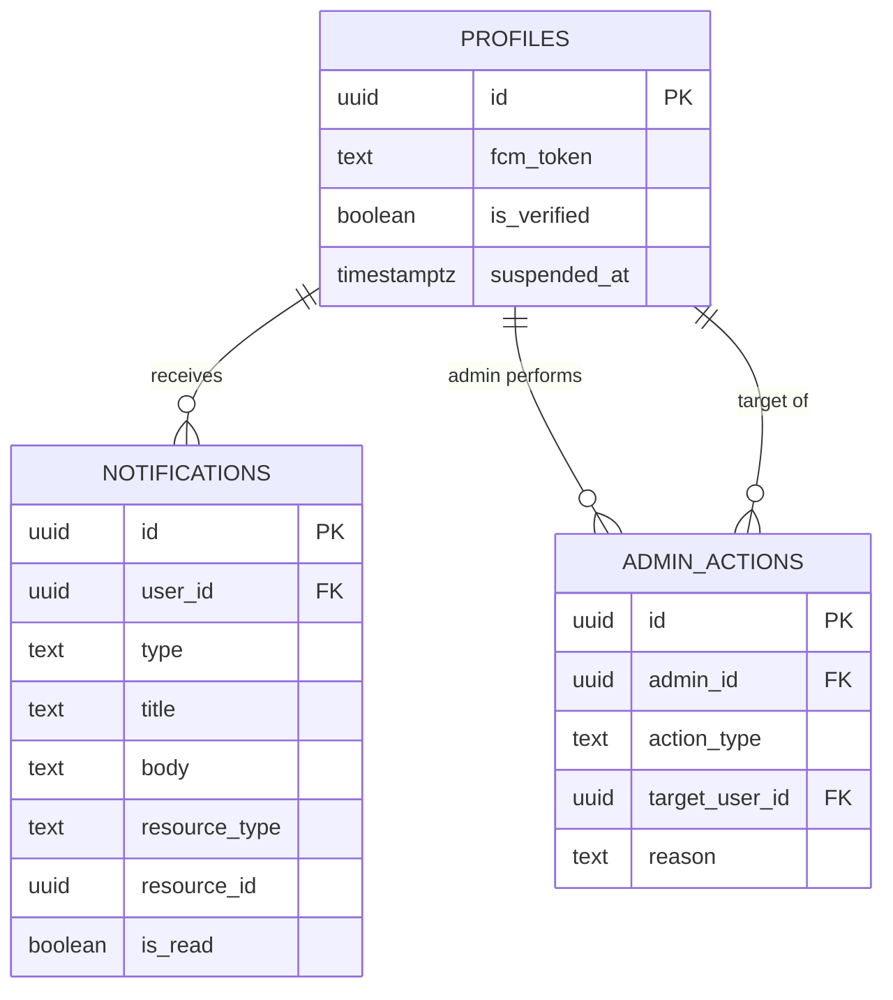

# Data Model — Phase 5 Production Features

**Branch**: `005-production-features` | **Date**: 2026-03-03

---

## Modified Tables

### `profiles` (existing)

| Column Added | Type | Constraints |
|-------------|------|-------------|
| `fcm_token` | `text` | nullable, updated on each app launch |
| `is_verified` | `boolean` | NOT NULL, default `false` |
| `suspended_at` | `timestamptz` | nullable, set by admin moderation |

---

## New Tables

### `admin_actions`

| Column | Type | Constraints |
|--------|------|-------------|
| `id` | `uuid` | PK, default `gen_random_uuid()` |
| `admin_id` | `uuid` | FK → `profiles.id`, NOT NULL |
| `action_type` | `text` | NOT NULL, CHECK IN ('verify_factory', 'reject_factory', 'suspend_user', 'unsuspend_user', 'remove_content', 'warn_user') |
| `target_user_id` | `uuid` | FK → `profiles.id`, nullable |
| `target_entity_type` | `text` | nullable ('rfq', 'quote', 'message', 'factory') |
| `target_entity_id` | `uuid` | nullable |
| `reason` | `text` | nullable |
| `created_at` | `timestamptz` | NOT NULL, default `now()` |

**RLS Policies**:
- Only admin users can INSERT into `admin_actions`
- Only admin users can SELECT from `admin_actions`

### `notifications`

| Column | Type | Constraints |
|--------|------|-------------|
| `id` | `uuid` | PK, default `gen_random_uuid()` |
| `user_id` | `uuid` | FK → `profiles.id`, NOT NULL |
| `type` | `text` | NOT NULL, CHECK IN ('new_quote', 'new_rfq', 'factory_verified', 'account_warning') |
| `title` | `text` | NOT NULL |
| `body` | `text` | NOT NULL |
| `resource_type` | `text` | nullable ('rfq', 'quote') |
| `resource_id` | `uuid` | nullable |
| `is_read` | `boolean` | NOT NULL, default `false` |
| `created_at` | `timestamptz` | NOT NULL, default `now()` |

**Indexes**: `(user_id, created_at DESC)` for chronological notification feed.

**RLS Policies**:
- Users can SELECT notifications where `user_id = auth.uid()`
- Users can UPDATE their own notifications (mark as read)
- Edge Functions (service role) can INSERT notifications

---

## Storage Buckets

### `rfq-pdfs` (new)

- **Access**: Authenticated read/write
- **Max file size**: 10 MB
- **Allowed MIME types**: `application/pdf`
- **Path pattern**: `{user_id}/{document_type}_{entity_id}.pdf`

---

## Postgres Helper Functions

### `is_admin()`

```sql
CREATE OR REPLACE FUNCTION public.is_admin()
RETURNS boolean
LANGUAGE sql
SECURITY DEFINER
STABLE
AS $$
  SELECT EXISTS (
    SELECT 1 FROM public.profiles
    WHERE id = auth.uid() AND role = 'admin'
  );
$$;
```

---

## Admin RLS Policies (Applied to All Tables)

```sql
-- Admin SELECT on all key tables
CREATE POLICY "Admins can view all profiles"
  ON public.profiles FOR SELECT
  USING (public.is_admin());

CREATE POLICY "Admins can view all rfq_requests"
  ON public.rfq_requests FOR SELECT
  USING (public.is_admin());

CREATE POLICY "Admins can view all rfq_quotes"
  ON public.rfq_quotes FOR SELECT
  USING (public.is_admin());

CREATE POLICY "Admins can view all messages"
  ON public.messages FOR SELECT
  USING (public.is_admin());

CREATE POLICY "Admins can view all factories"
  ON public.factories FOR SELECT
  USING (public.is_admin());

-- Admin UPDATE for moderation
CREATE POLICY "Admins can update profiles for moderation"
  ON public.profiles FOR UPDATE
  USING (public.is_admin())
  WITH CHECK (public.is_admin());

CREATE POLICY "Admins can update factories for verification"
  ON public.factories FOR UPDATE
  USING (public.is_admin())
  WITH CHECK (public.is_admin());
```

---

## Entity Relationships (Phase 5 additions)



---

## SQL Migration

```sql
-- ============================================================
-- Phase 5: Production Features Migration
-- ============================================================

-- 1. Add columns to profiles
ALTER TABLE public.profiles ADD COLUMN IF NOT EXISTS fcm_token TEXT;
ALTER TABLE public.profiles ADD COLUMN IF NOT EXISTS is_verified BOOLEAN NOT NULL DEFAULT false;
ALTER TABLE public.profiles ADD COLUMN IF NOT EXISTS suspended_at TIMESTAMPTZ;

-- 2. Helper function: is_admin()
CREATE OR REPLACE FUNCTION public.is_admin()
RETURNS boolean
LANGUAGE sql
SECURITY DEFINER
STABLE
AS $$
  SELECT EXISTS (
    SELECT 1 FROM public.profiles
    WHERE id = auth.uid() AND role = 'admin'
  );
$$;

-- 3. Admin actions table
CREATE TABLE IF NOT EXISTS public.admin_actions (
  id UUID PRIMARY KEY DEFAULT gen_random_uuid(),
  admin_id UUID NOT NULL REFERENCES public.profiles(id) ON DELETE CASCADE,
  action_type TEXT NOT NULL CHECK (action_type IN (
    'verify_factory', 'reject_factory', 'suspend_user',
    'unsuspend_user', 'remove_content', 'warn_user'
  )),
  target_user_id UUID REFERENCES public.profiles(id),
  target_entity_type TEXT,
  target_entity_id UUID,
  reason TEXT,
  created_at TIMESTAMPTZ NOT NULL DEFAULT now()
);

ALTER TABLE public.admin_actions ENABLE ROW LEVEL SECURITY;

CREATE POLICY "Only admins can insert actions"
  ON public.admin_actions FOR INSERT
  WITH CHECK (public.is_admin());

CREATE POLICY "Only admins can view actions"
  ON public.admin_actions FOR SELECT
  USING (public.is_admin());

-- 4. Notifications table
CREATE TABLE IF NOT EXISTS public.notifications (
  id UUID PRIMARY KEY DEFAULT gen_random_uuid(),
  user_id UUID NOT NULL REFERENCES public.profiles(id) ON DELETE CASCADE,
  type TEXT NOT NULL CHECK (type IN ('new_quote', 'new_rfq', 'factory_verified', 'account_warning')),
  title TEXT NOT NULL,
  body TEXT NOT NULL,
  resource_type TEXT,
  resource_id UUID,
  is_read BOOLEAN NOT NULL DEFAULT false,
  created_at TIMESTAMPTZ NOT NULL DEFAULT now()
);

CREATE INDEX idx_notifications_user_created ON public.notifications(user_id, created_at DESC);

ALTER TABLE public.notifications ENABLE ROW LEVEL SECURITY;

CREATE POLICY "Users can view own notifications"
  ON public.notifications FOR SELECT
  USING (user_id = auth.uid());

CREATE POLICY "Users can mark own notifications read"
  ON public.notifications FOR UPDATE
  USING (user_id = auth.uid())
  WITH CHECK (user_id = auth.uid());

-- Service role can insert (Edge Functions use service key)
CREATE POLICY "Service can insert notifications"
  ON public.notifications FOR INSERT
  WITH CHECK (true);

-- 5. Admin RLS policies on existing tables
CREATE POLICY "Admins can view all profiles"
  ON public.profiles FOR SELECT
  USING (public.is_admin());

CREATE POLICY "Admins can view all rfq_requests"
  ON public.rfq_requests FOR SELECT
  USING (public.is_admin());

CREATE POLICY "Admins can view all rfq_quotes"
  ON public.rfq_quotes FOR SELECT
  USING (public.is_admin());

CREATE POLICY "Admins can view all messages"
  ON public.messages FOR SELECT
  USING (public.is_admin());

CREATE POLICY "Admins can view all factories"
  ON public.factories FOR SELECT
  USING (public.is_admin());

CREATE POLICY "Admins can update profiles for moderation"
  ON public.profiles FOR UPDATE
  USING (public.is_admin())
  WITH CHECK (public.is_admin());

CREATE POLICY "Admins can update factories for verification"
  ON public.factories FOR UPDATE
  USING (public.is_admin())
  WITH CHECK (public.is_admin());

-- 6. Storage bucket for PDFs
-- (run via Supabase Dashboard or management API)
-- rfq-pdfs: private bucket, 10MB limit, application/pdf only
```
